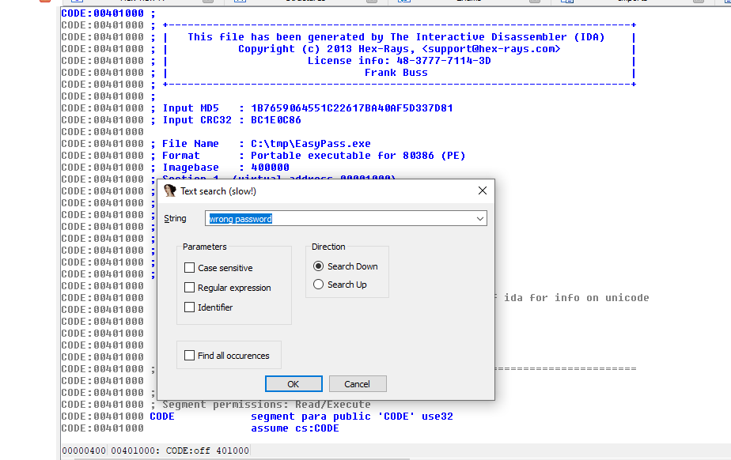
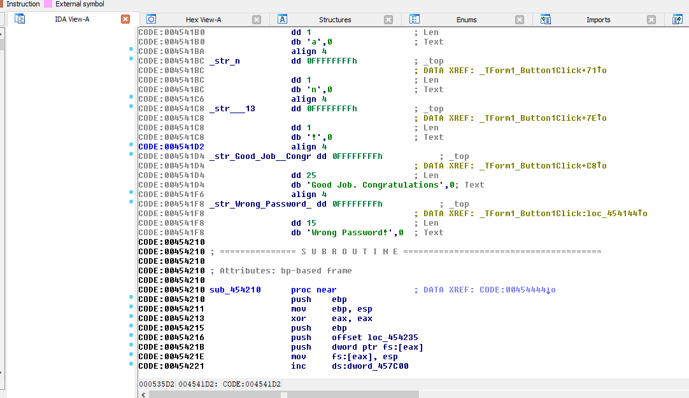
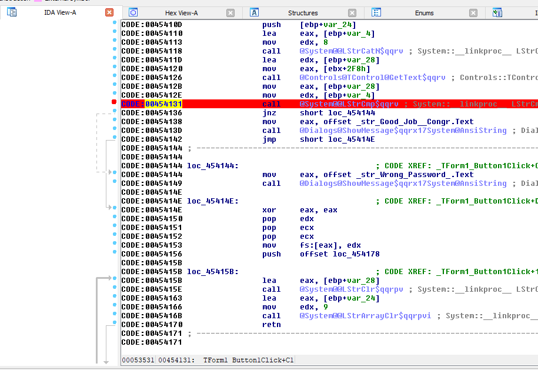
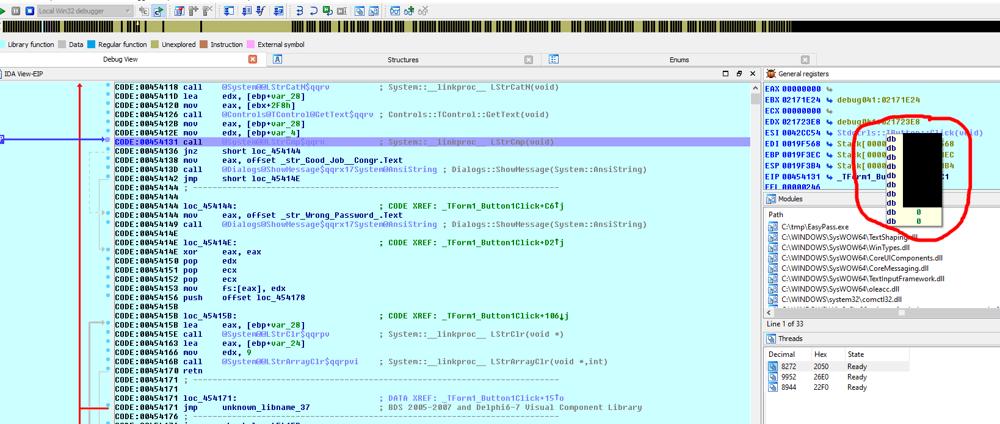

# Walkthrough of the hackthebox EasyPass challenge with IDA Pro

First start IDA Pro (32 bit). Open EasyPass.exe, scroll to top and search for the text "wrong password" with alt-T.

As you can see, there is also a text "Good Job".

Follow the XREF from where it and is referenced by clicking on it. You can see where the ShowMessage is called with the text. Before this, there is a call to a StrCmp function. Set a breakpoint on the StrCmp function call.

Then start in Debugger with F9, e.g. with WinDbg. Enter anything in the password field and click "Check Password". Mouse over on the EDX address and you can see the password (censored here to not spoil it).

